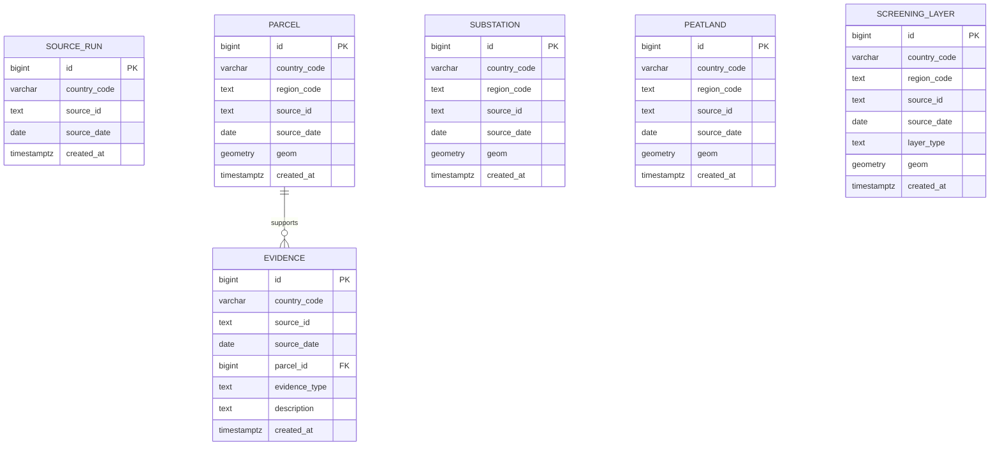

# Project IRIS Schema

```mermaid
erDiagram

    SOURCE_RUN {
        bigint id PK
        varchar country_code
        text source_id
        date source_date
        timestamptz created_at
    }

    PARCEL {
        bigint id PK
        varchar country_code
        text region_code
        text source_id
        date source_date
        geometry geom
        timestamptz created_at
    }

    SUBSTATION {
        bigint id PK
        varchar country_code
        text region_code
        text source_id
        date source_date
        geometry geom
        timestamptz created_at
    }

    PEATLAND {
        bigint id PK
        varchar country_code
        text region_code
        text source_id
        date source_date
        geometry geom
        timestamptz created_at
    }

    SCREENING_LAYER {
        bigint id PK
        varchar country_code
        text region_code
        text source_id
        date source_date
        text layer_type
        geometry geom
        timestamptz created_at
    }

    EVIDENCE {
        bigint id PK
        varchar country_code
        text source_id
        date source_date
        bigint parcel_id FK
        text evidence_type
        text description
        timestamptz created_at
    }

    PARCEL ||--o{ EVIDENCE : supports
```